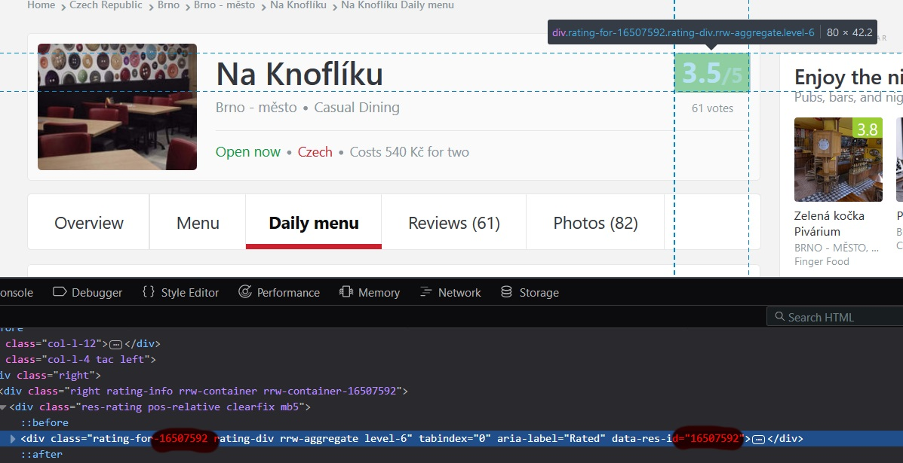

# Lunchbox

A simple daily menu scraper written using Spring Boot and Groovy. Works for the central Brno area.

## How to run it

See the [Jenkinsfile](Jenkinsfile):

1. check it out
   ```
   git clone ....
   ````
1. build it using gradle
   ```
   ./gradlew build
   ```
1. run it using java
   ```
   java -jar build/libs/lunchbox-x.x.x-SNAPSHOT.jar
   ```

## How to configure

See file [application.properties](src/main/resources/application.properties)

You will need:

* a hipchat room id
* hipchat room secret token
* zomato access token

You can also implement your own consumer e.g. for Slack or twitter. See the [MessageConsumer](src/main/groovy/lunchbox/MessageConsumer.groovy) interface.

## How to get Zomato restaurant ID

1. Go to [Zomato.com](https://www.zomato.com) and find your restaurant
1. Open browser developer tools and inspect the Rating box
1. The actual restaurant ID is used in identifiers and data fields in HTML


